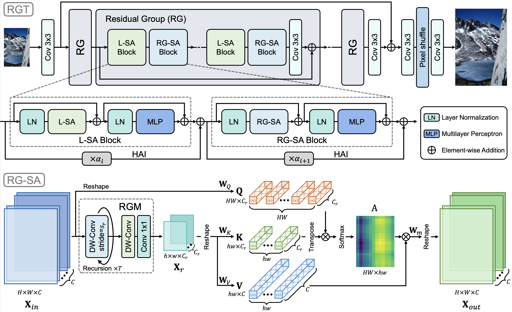
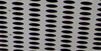
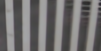
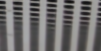
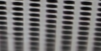
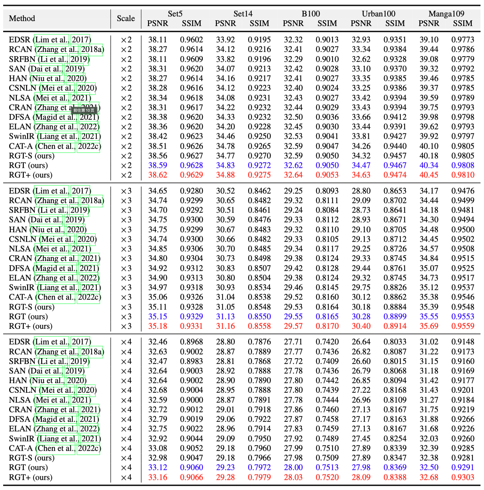
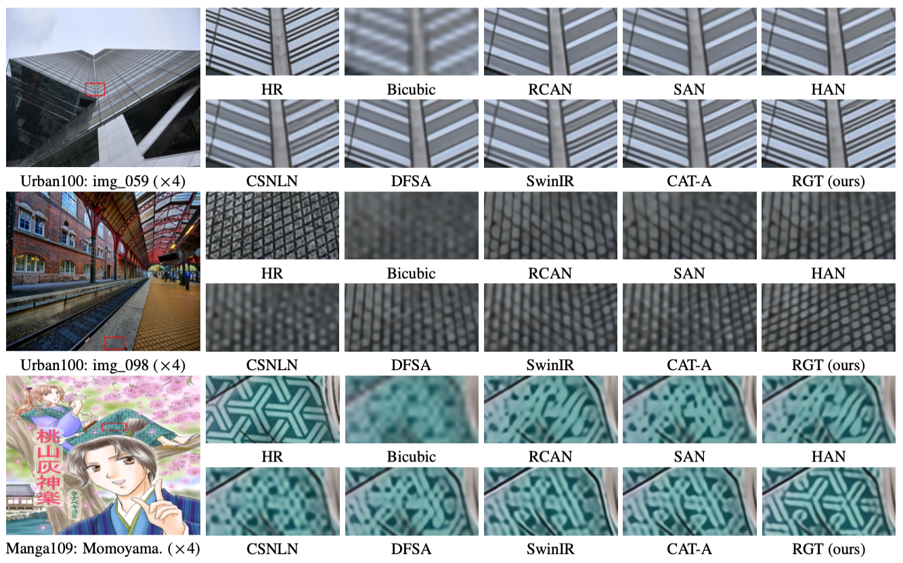
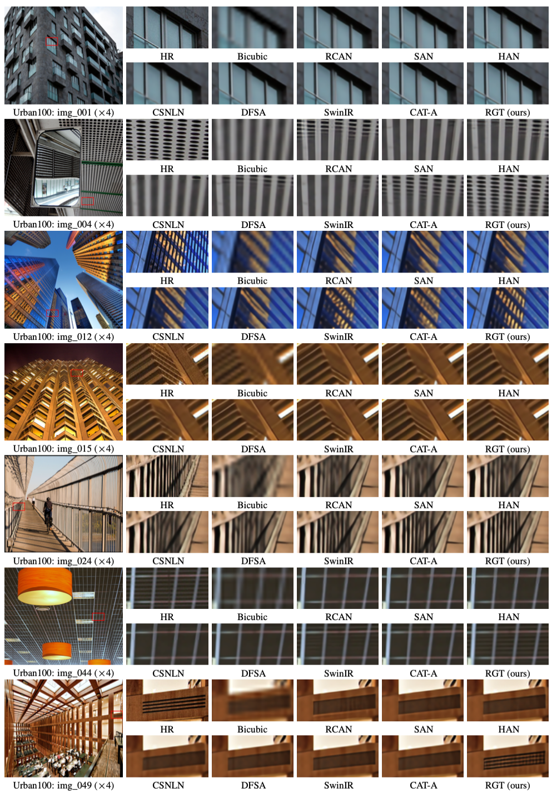
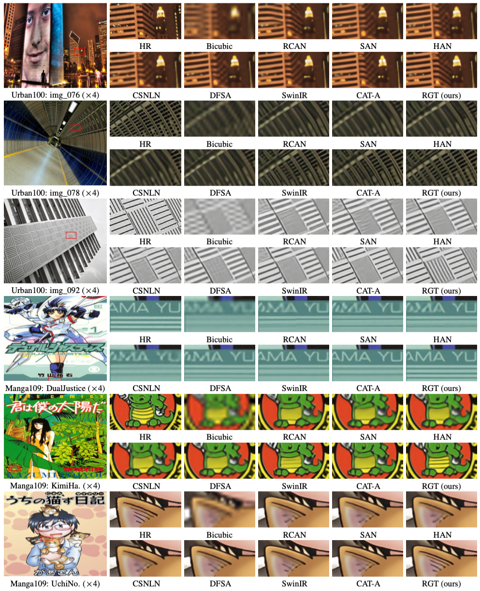

# Recursive Generalization Transformer for Image Super-Resolution

[Zheng Chen](https://zhengchen1999.github.io/), [Yulun Zhang](http://yulunzhang.com/), [Jinjin Gu](https://www.jasongt.com/), [Linghe Kong](https://www.cs.sjtu.edu.cn/~linghe.kong/), and [Xiaokang Yang](https://scholar.google.com/citations?user=yDEavdMAAAAJ), "Recursive Generalization Transformer for Image Super-Resolution", arXiv, 2023

[[arXiv](https://arxiv.org/abs/2303.06373)] [[supplementary material](https://github.com/zhengchen1999/RGT/releases)] [visual results] [pretrained models]

#### 🔥🔥🔥 News

- **2023-09-29:** This repo is released.

---

> **Abstract:** Transformer architectures have exhibited remarkable performance in image super-resolution (SR). Since the quadratic computational complexity of the self-attention (SA) in Transformer, existing methods tend to adopt SA in a local region to reduce overheads. However, the local design restricts the global context exploitation, which is crucial for accurate image reconstruction. In this work, we propose the Recursive Generalization Transformer (RGT) for image SR, which can capture global spatial information and is suitable for high-resolution images. Specifically, we propose the recursive-generalization self-attention (RG-SA). It recursively aggregates input features into representative feature maps, and then utilizes cross-attention to extract global information. Meanwhile, the channel dimensions of attention matrices ($query$, $key$, and $value$) are further scaled to mitigate the redundancy in the channel domain. Furthermore, we combine the RG-SA with local self-attention to enhance the exploitation of the global context, and propose the hybrid adaptive integration (HAI) for module integration. The HAI allows the direct and effective fusion between features at different levels (local or global). Extensive experiments demonstrate that our RGT outperforms recent state-of-the-art methods quantitatively and qualitatively.
>
> <p align="center">
> 
> </p>

---

|                     HR                     |                       LR                        | [SwinIR](https://github.com/JingyunLiang/SwinIR) | [CAT](https://github.com/zhengchen1999/CAT) |                 RGT (ours)                  |
| :----------------------------------------: | :---------------------------------------------: | :----------------------------------------------: | :-----------------------------------------: | :-----------------------------------------: |
|  |  |    |  |  |
|  |  |    |  |  |

## ⚒️ TODO

* [ ] Release code and pretrained models

## 🔗 Contents

1. Datasets
1. Models
1. Training
1. Testing
1. [Results](#Results)
1. [Citation](#Citation)
1. [Acknowledgements](#Acknowledgements)

## 🔎 Results

We achieved state-of-the-art performance on synthetic and real-world blur dataset. Detailed results can be found in the paper.

<details>
<summary>Quantitative Comparison (click to expan)</summary>


- results in Table 2 of the main paper

<p align="center">
  
</p>
</details>

<details>
<summary>Visual Comparison (click to expan)</summary>


- results in Figure 6 of the main paper

<p align="center">
  
</p>


- results in Figure 4 of the supplementary material

<p align="center">
  
</p>


- results in Figure 5 of the supplementary material

<p align="center">
  
</p>
</details>

## 📎 Citation

If you find the code helpful in your resarch or work, please cite the following paper(s).

```
@article{chen2023recursive,
  title={Recursive Generalization Transformer for Image Super-Resolution},
  author={Chen, Zheng and Zhang, Yulun and Gu, Jinjin and Kong, Linghe and Yang, Xiaokang},
  journal={arXiv preprint arXiv:2303.06373},
  year={2023}
}
```

## 💡 Acknowledgements

This code is built on [BasicSR](https://github.com/XPixelGroup/BasicSR).

